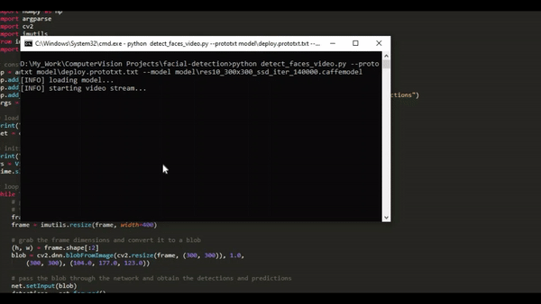

# facial-detection
 A simple implementation of facial detection using the pretrained `Caffe` model.
 
- the `prototxt` file contains the model architecture i.e. the layers
- the `ResNet caffemodel` file contains the weights of the actual layers of the SSD (Single Shot Detection) model.

# how to use?

**on images:**
```python
python detect_faces.py --image your-image-file.jpg --prototxt deploy.prototxt.txt \
      --model res10_300x300_ssd_iter_140000.caffemodel
```
**on webcam:**
```python
python detect_faces_video.py --prototxt deploy.prototxt.txt --model res10_300x300_ssd_iter_140000.caffemodel
```

